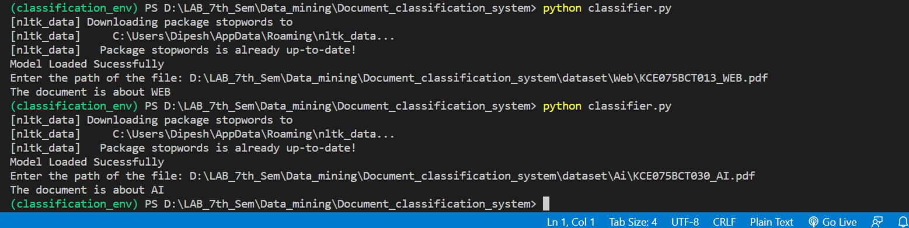

# AI based Document Classification System
## About
A system capable of classifying pdf files into either AI related file or Web related file based on the contents of the file.

## Technologies Used
> Natural Language Processing,Artificial Intelligence, Machine Learning, Python, Data Mining

## Outputs

### Acknowledgement
Special Thanks to [Siddhant Sharma](https://github.com/Siddhant128-bit), [Anish Shilpakar](https://github.com/JuJu2181)